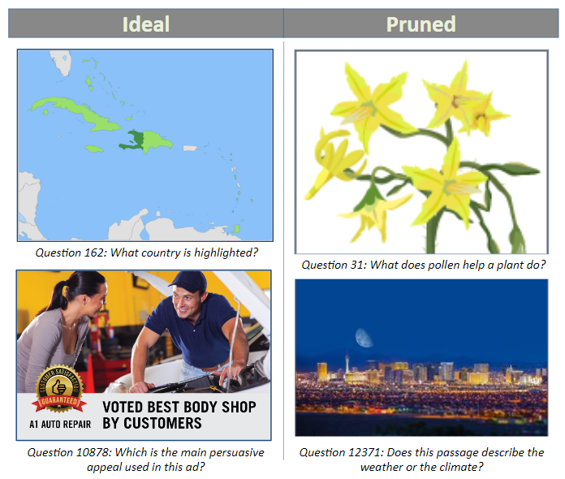
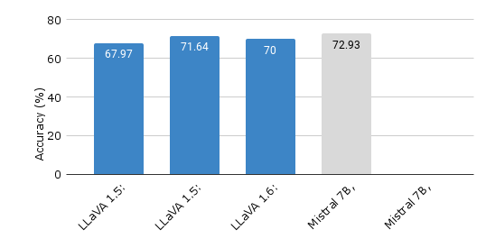

# Optimizing LLaVA: Measuring Mistral Against LLaMA for Visual Instruction Tuning

## Introduction

In the ever-expanding universe of artificial intelligence, Large Language Models (LLMs) have quickly moved from the shadows into the spotlight, transforming how we interact with technology. These models have mastered not just the art of conversation but have also stepped into the realm of understanding and generating visual content. 

Our focus shines on a pioneering approach that bridges the gap between language and vision, as introduced by Liu and colleagues in 2023. This innovative venture brings to life the Large Language-and-Vision Assistant (LLaVA), a multimodal marvel that integrates visual understanding with linguistic prowess, setting new standards for AI's capacity to follow complex instructions and engage with both text and imagery. The creation of LLaVA marks a significant milestone, as evidenced by its stellar performance across diverse benchmarks, proving its unparalleled multimodal fluency and instructional adeptness.

In an exciting development, we've enhanced LLaVA by incorporating the Mistral 7B model, an adjustment that significantly lowers computational demands while surpassing the original model's achievements. 

## Methods

### Models
While incorporating multiple modes of input, like images, into a large language model sounds complex, the approach we take is quite direct. We start by processing the images with an advanced visual encoder that transforms them into a format the language model can understand. Once in this form, the language model, prompted by a user's request, analyzes the visual information. Following this, it follows a well-established language model pattern, crafting a response in natural language. This process simplifies the intricate task of merging visual and textual data, making it more accessible for a wider audience.

Choosing the right Large Language Model (LLM) is crucial for the quality of the output. In this study, we decided to use Mistral, differing from past studies that preferred models like LLaMA and Vicuna. Mistral stands out because it has shown significantly better performance and faster processing speeds. This is mainly due to two technical advancements: sliding window attention and grouped query attention.

Sliding window attention limits the focus of each layer to a nearby set of features, which helps the model efficiently manage data by concentrating on immediate information while still keeping an eye on the broader context. On the other hand, grouped query attention optimizes the model by streamlining calculations, avoiding unnecessary repetition, and thereby speeding up both learning and application phases. These innovations make Mistral a more effective and efficient choice for handling complex language tasks.

### Dataset

To speed up training, we've developed a new approach that allows our model to match the performance of the original while using only a fraction (one-sixth) of the data originally needed for fine-tuning. We've carefully chosen 1,000 key pieces of data from the original 12,726, guided by three main principles designed to make the training process more effective.

First, we emphasize the use of images, as our model already understands language, we aim to improve its ability to work with images and texts together. Second, we ensure diversity by including a variety of question types, covering all subjects at least once to ensure a well-rounded dataset. Third, we focus on including more challenging questions that require deeper analysis or knowledge, as these are more beneficial for training the model.

Additionally, we've explored another technique for enhancing our training process on a larger scale. By analyzing all potential training data with a sophisticated multimodal model, we've identified 1,000 unique and varied training examples. This was achieved by selecting examples that differ significantly from each other, based on a mathematical measure of difference. Testing another model with this specially curated dataset has shown promising results. This approach not only makes our training more efficient but also ensures that the model learns from the most informative and diverse examples.

### Training

Our training process, guided by LLaVA's recommendations, involves a structured approach to integrating visual and language models for instruction-following tasks. Initially, we keep the pretrained weights of both the visual encoder and the language model (LLM) frozen to maintain their learned representations. During this phase, the focus is on training a projection matrix that maps the visual encoder's output to the word embeddings of the LLM, using a specific set of 558k language-image instruction samples from LLaVA for this "pretraining" phase.

Following this initial step, we proceed to unfreeze the language model weights to allow for fine-tuning on the same datasets. This fine-tuning phase is critical for adapting the model to the specific nuances of the instruction-following tasks at hand.

The training is executed on a single A100 GPU, adhering to the hyperparameters recommended for each LLM. The compared model undergoes training for one epoch with an initial learning rate of 1e-3 and a batch size of 64. Subsequently, it enters the fine-tuning stage for 15 epochs with an adjusted learning rate of 2e-5 and a reduced batch size of 32. Throughout the process, the Adam optimizer is employed without any weight decay adjustments. This structured approach is designed to optimize the integration of visual and linguistic components for enhanced instruction-following capabilities.
   
## Results & Conclusion

