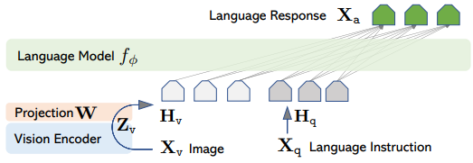

# Optimizing LLaVA: Measuring Mistral Against LLaMA for Visual Instruction Tuning

## Introduction

In the ever-expanding universe of artificial intelligence, Large Language Models (LLMs) have quickly moved from the shadows into the spotlight, transforming how we interact with technology. These models have mastered not just the art of conversation but have also stepped into the realm of understanding and generating visual content. 

Our focus shines on a pioneering approach that bridges the gap between language and vision, as introduced by Liu and colleagues in 2023. This innovative venture brings to life the Large Language-and-Vision Assistant (LLaVA), a multimodal marvel that integrates visual understanding with linguistic prowess, setting new standards for AI's capacity to follow complex instructions and engage with both text and imagery. The creation of LLaVA marks a significant milestone, as evidenced by its stellar performance across diverse benchmarks, proving its unparalleled multimodal fluency and instructional adeptness.

In an exciting development, we've enhanced LLaVA by incorporating the Mistral 7B model, an adjustment that significantly lowers computational demands while surpassing the original model's achievements. 

## Methods

### Models

### Dataset

### Training

## Results 

## Conclusion
